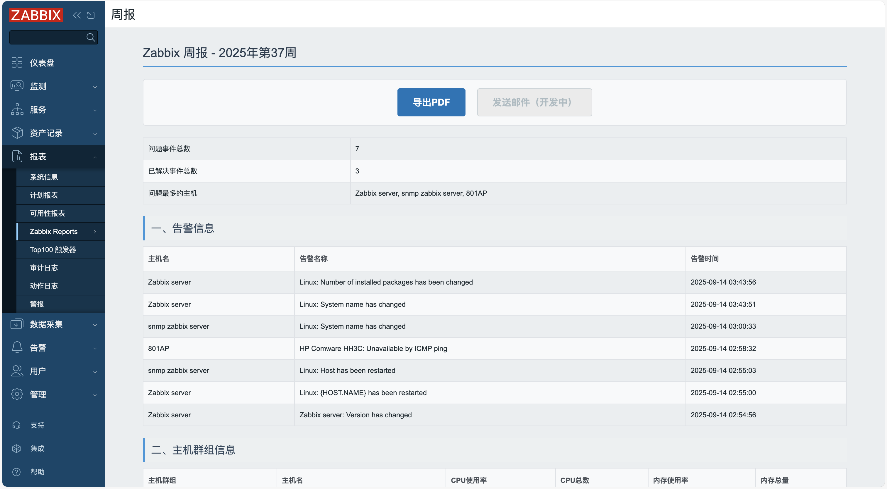

# Zabbix Modules 集合

[简体中文](#描述) | [English](#english)

## 描述

这是一个包含多个Zabbix模块的项目集合，每个模块都是独立的Zabbix扩展，为Zabbix监控系统提供额外的功能。

## 模块列表

### 1. Zabbix Reports

**简介**：用于生成每日、周、月报表的Zabbix 7.0 前端模块，支持报表预览、PDF导出和邮件推送功能。

**功能特性**：

- 支持每日、周、月报表生成
- 报警数量和状态统计
- 显示报警最多的主机（前10名）
- 显示CPU和内存使用率最高的主机（前10名）
- 页面预览报表
- 手动导出PDF
- 邮件推送报表（HTML格式）

**文档链接**：[zabbix_reports/README.md](./zabbix_reports/README.md)



**兼容性**：Zabbix 7.0

### 2. Zabbix CMDB

**简介**：用于配置管理数据库（CMDB）的Zabbix 7.0前端模块，提供主机信息的集中查看和管理功能。

**功能特性**：

- 支持通过主机名或IP地址进行搜索
- 支持按主机分组进行筛选
- 显示主机名、IP地址、接口方式、CPU总量、内存总量、主机分组等信息
- 支持中英文界面国际化
- 响应式设计，适配不同屏幕尺寸

**文档链接**：[zabbix_cmdb/README.md](./zabbix_cmdb/README.md)


**兼容性**：Zabbix 7.0

## 安装说明 / Installation

### 使用Git克隆安装所有模块

如果您想一次性安装所有模块，可以使用Git克隆整个项目：

1. **克隆项目到Zabbix模块目录**：

   ```bash
   cd /usr/share/zabbix/modules/
   git clone https://github.com/X-Mars/zabbix_modules.git .
   ```

   注意：命令末尾的 `.` 表示克隆到当前目录，请谨慎操作。

2. **或者克隆到临时目录后移动**：

   ```bash
   git clone https://github.com/X-Mars/zabbix_modules.git temp_zabbix_modules
   cp -r temp_zabbix_modules/* /usr/share/zabbix/modules/
   rm -rf temp_zabbix_modules
   ```

3. **启用模块**：

   进入Zabbix Web界面：
   - 导航到 **Administration → General → Modules**
   - 点击 **Scan directory** 扫描新模块
   - 找到并启用 "Zabbix Reports" 和 "Zabbix CMDB" 模块


4. **验证安装**：

   刷新页面后，您将在相应菜单中看到新模块：
   - Reports → Zabbix Reports
   - Inventory → CMDB

### 单独安装模块

每个模块都有独立的安装说明，请参考各模块的README.md文件获取详细的安装和配置步骤。

Each module has independent installation instructions. Please refer to the README.md file of each module for detailed installation and configuration steps.

---

## English

## Description

This is a collection of Zabbix modules, where each module is an independent Zabbix extension that provides additional functionality to the Zabbix monitoring system.

## Module List

### 1. Zabbix Reports

**Description**: A frontend module for Zabbix 7.0 that generates daily, weekly, and monthly reports. It supports report preview, PDF export, and email push functionality.

**Features**:

- Support for daily, weekly, and monthly report generation
- Problem count and status statistics
- Display top problem hosts (Top 10)
- Display top CPU and memory utilization hosts (Top 10)
- In-page report preview
- Manual PDF export
- Email push reports (HTML format)

**Documentation**: [zabbix_reports/README.md](./zabbix_reports/README.md)

**Author**: 火星小刘  
**Version**: 1.0.0  
**Compatibility**: Zabbix 7.0

### 2. Zabbix CMDB

**Description**: A frontend module for Zabbix 7.0 that provides Configuration Management Database (CMDB) functionality, offering centralized viewing and management of host information.

**Features**:

- Support searching by hostname or IP address
- Support filtering by host groups
- Display host name, IP address, interface type, CPU total, memory total, host groups
- Support for Chinese and English interfaces
- Responsive design that adapts to different screen sizes

**Documentation**: [zabbix_cmdb/README.md](./zabbix_cmdb/README.md)

**Author**: 火星小刘  
**Version**: 1.0.0  
**Compatibility**: Zabbix 7.0

## Installation Instructions

### Install All Modules Using Git Clone

If you want to install all modules at once, you can use Git to clone the entire project:

1. **Clone the project to Zabbix modules directory**:

   ```bash
   cd /usr/share/zabbix/modules/
   git clone https://github.com/X-Mars/zabbix_modules.git .
   ```

   Note: The `.` at the end means clone to the current directory, please be careful.

2. **Or clone to a temporary directory and then move**:

   ```bash
   git clone https://github.com/X-Mars/zabbix_modules.git temp_zabbix_modules
   cp -r temp_zabbix_modules/* /usr/share/zabbix/modules/
   rm -rf temp_zabbix_modules
   ```

3. **Enable modules**:

   Go to Zabbix Web UI:
   - Navigate to **Administration → General → Modules**
   - Click **Scan directory** to scan for new modules
   - Find and enable "Zabbix Reports" and "Zabbix CMDB" modules

4. **Verify installation**:

   After refreshing the page, you will see the new modules in the respective menus:
   - Reports → Zabbix Reports
   - Inventory → CMDB

### Install Individual Modules

Each module has independent installation instructions. Please refer to the README.md file of each module for detailed installation and configuration steps.

## 贡献 / Contributing

欢迎提交问题报告和功能改进建议。请在相应模块的目录下提交问题。

Issues and feature improvement suggestions are welcome. Please submit issues in the appropriate module directory.

## 许可证 / License

所有模块遵循Zabbix的许可证条款。详情请见 [Zabbix许可证](https://www.zabbix.com/license)。

All modules follow the Zabbix license terms. For details, see [Zabbix License](https://www.zabbix.com/license).
