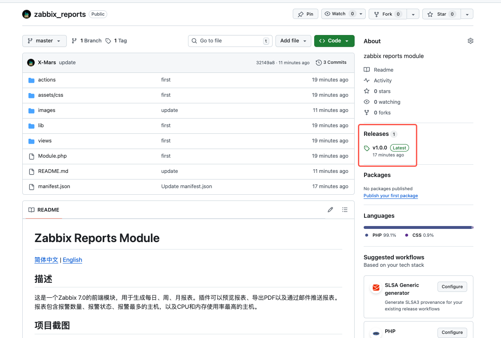

# Zabbix Modules 集合

[English](README_en.md)

## ✨ 版本兼容性

所有模块均兼容 Zabbix 6.0 和 7.0+ 版本。

- ✅ Zabbix 6.0.x
- ✅ Zabbix 7.0.x
- ✅ Zabbix 7.4.x

## 描述

这是一个包含多个Zabbix模块的项目集合，每个模块都是独立的，为Zabbix监控系统提供额外的功能。

## 模块列表

### 1. Zabbix Reports

**简介**：用于生成每日、周、月报表的Zabbix前端模块，支持报表预览、PDF导出和邮件推送功能。

**功能特性**：

- 支持每日、周、月报表生成
- 报警数量和状态统计
- 显示报警最多的主机（前10名）
- 显示CPU和内存使用率最高的主机（前10名）
- 页面预览报表
- 手动导出PDF
- 邮件推送报表（HTML格式）

**文档链接**：[zabbix_reports/README.md](./zabbix_reports/README.md)

**兼容性**：Zabbix 6.0.x, 7.0.x, 7.4.x

### 2. Zabbix CMDB

**简介**：用于配置管理数据库（CMDB）的Zabbix前端模块，提供主机信息的集中查看和管理功能。

**功能特性**：

- 支持通过主机名或IP地址进行搜索
- 支持按主机分组进行筛选
- 显示主机名、IP地址、接口方式、CPU总量、内存总量、主机分组等信息
- 支持中英文界面国际化
- 响应式设计，适配不同屏幕尺寸

**文档链接**：[zabbix_cmdb/README.md](./zabbix_cmdb/README.md)

**兼容性**：Zabbix 6.0.x, 7.0.x, 7.4.x

### 3. Zabbix Graph Trees

**简介**：用于以树形结构浏览监控数据的Zabbix前端模块，提供主机分组树形导航、监控项筛选和实时图表展示功能。

**功能特性**：

- 树形结构浏览主机分组和主机
- 支持按标记（Tag）和标记值筛选监控项
- 监控项多选下拉框，灵活选择要展示的图表
- SVG折线图实时展示监控数据
- 多图表tooltip同步显示
- 图表放大全屏查看
- 自动刷新功能（支持5/10/20/30/60秒间隔）
- 多种时间范围选择（1小时至30天）
- 支持中英文界面国际化

**文档链接**：[zabbix_graphtrees/README.md](./zabbix_graphtrees/README.md)

**兼容性**：Zabbix 6.0.x, 7.0.x, 7.4.x

### 4. Zabbix Rack

**简介**：用于数据中心机柜可视化和主机位置管理的Zabbix前端模块，支持机房和机柜的配置，以及主机的可视化分配。

**功能特性**：

- 机房管理：创建、编辑、删除机房
- 机柜管理：创建、编辑、删除机柜，支持1-60U高度配置
- 机柜可视化：42U机柜垂直布局，U位占用状态显示
- 主机分配：将Zabbix主机分配到机柜指定U位
- 搜索功能：按机柜或主机名称搜索
- 支持中英文界面国际化
- 响应式设计，适配不同屏幕尺寸

**文档链接**：[zabbix_rack/README.md](./zabbix_rack/README.md)

**兼容性**：Zabbix 6.0.x, 7.0.x, 7.4.x

## 安装说明

### 安装模块

这是最简单快捷的安装方式，一次性部署所有模块：

1. **Zabbix 6.0 / 7.0 部署方法**

```bash
git clone https://github.com/X-Mars/zabbix_modules.git /usr/share/zabbix/modules/
```

2. **Zabbix 7.4 部署方法**

```bash
git clone https://github.com/X-Mars/zabbix_modules.git /usr/share/zabbix/ui/modules/
```

3. **如果使用Zabbix 6.0，修改manifest_version**

```bash
cd /usr/share/zabbix/modules/
# 修改 zabbix_reports 模块
sed -i 's/"manifest_version": 2.0/"manifest_version": 1.0/' zabbix_reports/manifest.json

# 修改 zabbix_cmdb 模块
sed -i 's/"manifest_version": 2.0/"manifest_version": 1.0/' zabbix_cmdb/manifest.json

# 修改 zabbix_graphtrees 模块
sed -i 's/"manifest_version": 2.0/"manifest_version": 1.0/' zabbix_graphtrees/manifest.json

# 修改 zabbix_rack 模块
sed -i 's/"manifest_version": 2.0/"manifest_version": 1.0/' zabbix_rack/manifest.json
```

如果使用 Zabbix 7.0+，则无需修改，保持默认值即可。

### 启用模块

完成文件部署后，在Zabbix Web界面中启用模块：

1. 进入Zabbix Web界面
2. 导航到 **Administration → General → Modules**
3. 点击 **Scan directory** 扫描新模块
4. 找到并启用相应模块




### 验证安装

刷新页面后，您将在相应菜单中看到新模块：

- **Reports → Zabbix Reports** (每日/周/月报表)
- **Inventory → CMDB** (主机列表/主机分组)
- **Monitoring → Graph Trees** (图表树)
- **Inventory → Rack Management** (机柜管理)

### 单独安装模块

每个模块都有独立的安装说明，请参考各模块的README.md文件获取详细的安装和配置步骤。

## 贡献

欢迎提交问题报告和功能改进建议。请在相应模块的目录下提交问题。

## 许可证

所有模块遵循Zabbix的许可证条款。详情请见 [Zabbix许可证](https://www.zabbix.com/license)。
