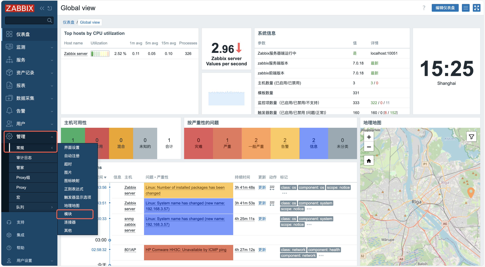
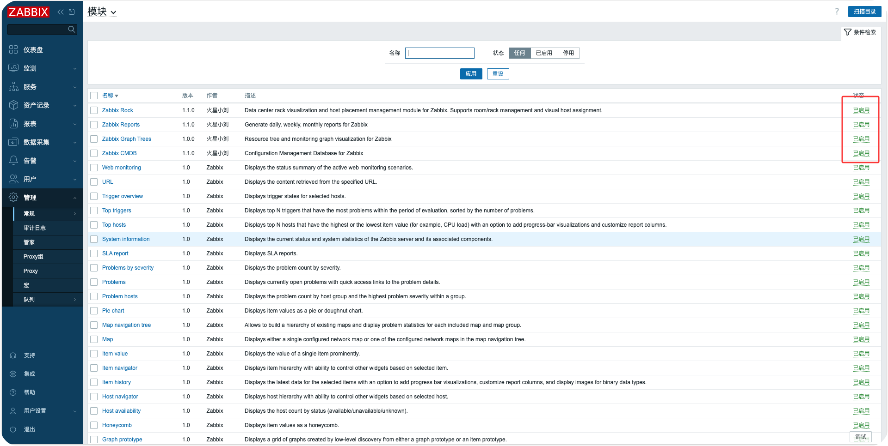

# Zabbix Modules Collection

[中文](README.md)

## ✨ Version Compatibility

All modules are compatible with Zabbix 6.0 and 7.0+ versions.

- ✅ Zabbix 6.0.x
- ✅ Zabbix 7.0.x
- ✅ Zabbix 7.4.x

## Description

This is a collection of Zabbix modules, where each module is an independent Zabbix extension that provides additional functionality to the Zabbix monitoring system.

## Module List

### 1. Zabbix Reports

**Description**: A frontend module for Zabbix that generates daily, weekly, and monthly reports. It supports report preview, PDF export, and email push functionality.

**Features**:

- Support for daily, weekly, and monthly report generation
- Problem count and status statistics
- Display top problem hosts (Top 10)
- Display top CPU and memory utilization hosts (Top 10)
- In-page report preview
- Manual PDF export
- Email push reports (HTML format)

**Documentation**: [zabbix_reports/README.md](./zabbix_reports/README.md)

**Compatibility**: Zabbix 6.0.x, 7.0.x, 7.4.x

### 2. Zabbix CMDB

**Description**: A frontend module for Zabbix that provides Configuration Management Database (CMDB) functionality, offering centralized viewing and management of host information.

**Features**:

- Support searching by hostname or IP address
- Support filtering by host groups
- Display host name, IP address, interface type, CPU total, memory total, host groups
- Support for Chinese and English interfaces
- Responsive design that adapts to different screen sizes

**Documentation**: [zabbix_cmdb/README.md](./zabbix_cmdb/README.md)

**Compatibility**: Zabbix 6.0.x, 7.0.x, 7.4.x

### 3. Zabbix Graph Trees

**Description**: A frontend module for Zabbix that provides tree-structured browsing of monitoring data, featuring host group tree navigation, item filtering, and real-time chart display.

**Features**:

- Tree-structured browsing of host groups and hosts
- Filter items by tags and tag values
- Multi-select dropdown for flexible chart selection
- SVG line charts for real-time monitoring data display
- Synchronized tooltip display across multiple charts
- Full-screen chart zoom view
- Auto-refresh functionality (5/10/20/30/60 second intervals)
- Multiple time range selections (1 hour to 30 days)
- Support for Chinese and English interfaces

**Documentation**: [zabbix_graphtrees/README.md](./zabbix_graphtrees/README.md)

**Compatibility**: Zabbix 6.0.x, 7.0.x, 7.4.x

### 4. Zabbix Rack

**Description**: A frontend module for Zabbix that provides data center rack visualization and host placement management, supporting room and rack configuration, and visual host assignment.

**Features**:

- Room Management: Create, edit, delete rooms
- Rack Management: Create, edit, delete racks, support 1-60U height configuration
- Rack Visualization: 42U rack vertical layout, U position occupancy status display
- Host Assignment: Assign Zabbix hosts to specific U positions in racks
- Search Functionality: Search by rack or host name
- Support for Chinese and English interfaces
- Responsive design that adapts to different screen sizes

**Documentation**: [zabbix_rack/README.md](./zabbix_rack/README.md)

**Compatibility**: Zabbix 6.0.x, 7.0.x, 7.4.x

## Installation Instructions

### Install Modules

This is the simplest and fastest way to deploy all modules at once:

1. **Zabbix 6.0 / 7.0 deployment method**

```bash
git clone https://github.com/X-Mars/zabbix_modules.git /usr/share/zabbix/modules/
```

2. **Zabbix 7.4 deployment method**

```bash
git clone https://github.com/X-Mars/zabbix_modules.git /usr/share/zabbix/ui/modules/
```

3. **For Zabbix 6.0, modify manifest_version**

```bash
cd /usr/share/zabbix/modules/
# Modify zabbix_reports module
sed -i 's/"manifest_version": 2.0/"manifest_version": 1.0/' zabbix_reports/manifest.json

# Modify zabbix_cmdb module
sed -i 's/"manifest_version": 2.0/"manifest_version": 1.0/' zabbix_cmdb/manifest.json

# Modify zabbix_graphtrees module
sed -i 's/"manifest_version": 2.0/"manifest_version": 1.0/' zabbix_graphtrees/manifest.json

# Modify zabbix_rack module
sed -i 's/"manifest_version": 2.0/"manifest_version": 1.0/' zabbix_rack/manifest.json
```

For Zabbix 7.0+, no modification needed, keep the default value.

### Enable Modules

After deploying the files, enable the modules in Zabbix Web UI:

1. Go to Zabbix Web UI
2. Navigate to **Administration → General → Modules**
3. Click **Scan directory** to scan for new modules
4. Find and enable the corresponding modules




### Verify Installation

After refreshing the page, you will see the new modules in the respective menus:

- **Reports → Zabbix Reports** (Daily/Weekly/Monthly reports)
- **Inventory → CMDB** (Host List/Host Groups)
- **Monitoring → Graph Trees** (Graph Trees)
- **Inventory → Rack Management** (Rack Management)

### Install Individual Modules

Each module has independent installation instructions. Please refer to the README.md file of each module for detailed installation and configuration steps.

## Contributing

Issues and feature improvement suggestions are welcome. Please submit issues in the appropriate module directory.

## License

All modules follow the Zabbix license terms. For details, see [Zabbix License](https://www.zabbix.com/license).

## Author

火星小刘 (Mars Xiao Liu)