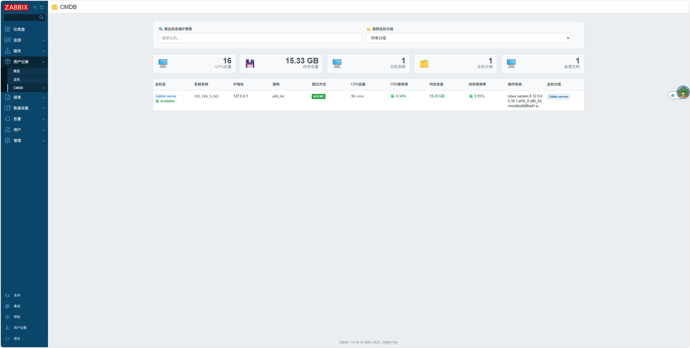
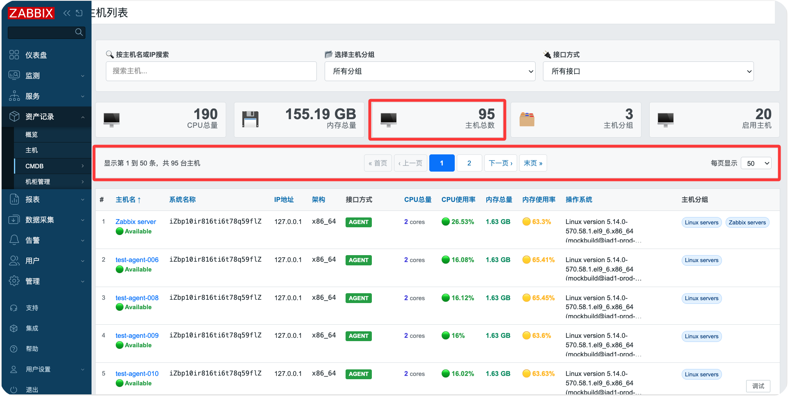
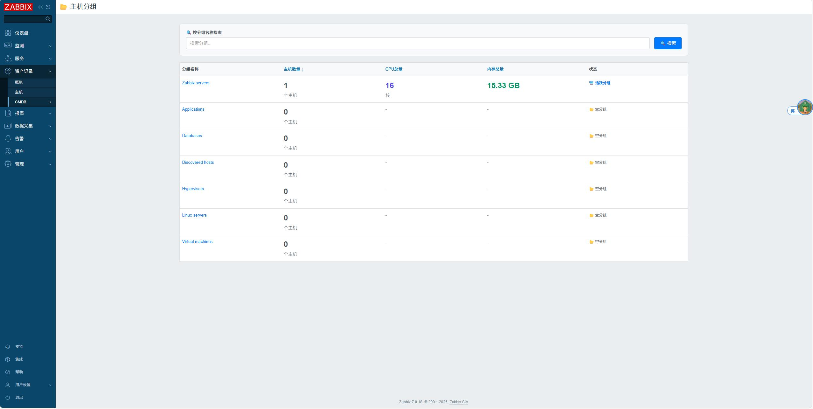

# Zabbix CMDB 模块

[English](README_en.md)

## ✨ 版本兼容性

本模块兼容 Zabbix 6.0 / 7.0+ / 8.0+ 版本。

- ✅ Zabbix 6.0.x
- ✅ Zabbix 7.0.x
- ✅ Zabbix 7.4.x
- ✅ Zabbix 8.0.x

**兼容性说明**：模块内置智能版本检测机制，自动适配不同版本的 Zabbix API 和类库，无需手动配置。

## 描述

这是一个 Zabbix 前端模块，用于配置管理数据库（CMDB），提供主机信息的集中查看和管理功能。模块在 Zabbix Web 的资产记录菜单下新增 CMDB 菜单，支持主机搜索和分组筛选。





## 功能特性

- **主机搜索**：支持通过主机名或IP地址进行搜索
- **分组筛选**：支持按主机分组进行筛选
- **主机信息展示**：
  - 主机名（可点击跳转到主机详情）
  - IP地址
  - 接口方式（Agent、SNMP、IPMI、JMX）
  - CPU总量
  - 内存总量
  - 内核版本
  - 主机分组
  - 主机状态（活跃/禁用）
- **主机分组管理**：查看所有主机分组的统计信息
- **分组搜索**：支持按分组名称搜索
- **分组统计**：显示分组中的主机数量、CPU总量、内存总量
- **国际化支持**：支持中英文界面
- **响应式设计**：适配不同屏幕尺寸
- **现代化界面**：采用渐变色彩和动画效果的现代化设计
- **统计信息**：显示主机总数、分组总数和活跃主机数统计

## 安装步骤

### 安装模块

```bash
# Zabbix 6.0 / 7.0 部署方法
git clone https://github.com/X-Mars/zabbix_modules.git /usr/share/zabbix/modules/

# Zabbix 7.2+ / 7.4 / 8.0 部署方法
git clone https://github.com/X-Mars/zabbix_modules.git /usr/share/zabbix/ui/modules/
```

### ⚠️ 修改 manifest.json 文件

```bash
# ⚠️ 如果使用Zabbix 6.0，修改manifest_version
sed -i 's/"manifest_version": 2.0/"manifest_version": 1.0/' zabbix_cmdb/manifest.json
```

### 启用模块

1. 转到 **Administration → General → Modules**。
2. 点击 **Scan directory** 按钮扫描新模块。
3. 找到 "Zabbix CMDB" 模块，点击启用模块。
4. 刷新页面，模块将在 **Inventory** 菜单下显示为 "CMDB" 子菜单，包含 "主机列表" 和 "主机分组" 两个子项。

## 注意事项

- **性能考虑**：对于大型环境，建议适当限制查询结果数量。
- **数据准确性**：显示的信息基于Zabbix数据库的当前状态。
- **监控项依赖**：CPU和内存信息的显示依赖于相应的监控项配置。

## 开发

插件基于Zabbix模块框架开发。文件结构：

- `manifest.json`：模块配置
- `Module.php`：菜单注册
- `actions/Cmdb.php`：主机列表业务逻辑处理
- `actions/CmdbGroups.php`：主机分组业务逻辑处理
- `views/cmdb.php`：主机列表页面视图
- `views/cmdb.groups.php`：主机分组页面视图
- `lib/LanguageManager.php`：国际化语言管理
- `lib/ItemFinder.php`：监控项查找工具
- `lib/ViewRenderer.php`：视图渲染工具
- `lib/ZabbixVersion.php`：版本兼容工具

如需扩展，可参考[Zabbix模块开发文档](https://www.zabbix.com/documentation/7.0/en/devel/modules)。

## 许可证

本项目遵循Zabbix的许可证。详情请见[Zabbix许可证](https://www.zabbix.com/license)。


## CMDB 指标配置

超级管理员可在「资产记录 → CMDB → CMDB 配置」管理 CPU 总量、CPU 使用率、内存总量和内存使用率的监控项规则。

- 配置保存在 `data/item_rules.json`，按每个指标数组的顺序匹配，首条命中后停止。
- 每条规则选择监控项名称或 Key，以及精确匹配或模糊匹配。模糊匹配不区分大小写，支持包含匹配与 `*` 通配符；`[]` 等字符按字面匹配。
- 使用「上移」「下移」调整优先级。匹配多个启用监控项时选择 itemid 最小者；无最新值时查询该监控项历史，不跳过到后面的规则。
- CPU 总量为核数，内存总量为字节，使用率为百分比。空闲率/可用率规则可选择 `100 − 原值` 转换。
- 空规则列表停用该指标。主机列表、顶部汇总与分组统计使用同一份配置，保存后下一次请求生效。
- 默认 JSON 迁移了原有规则（也保留系统信息规则）；原有 CPU load、Used memory、宽泛 memory.size 等备选可能单位不符合目标指标，应按实际模板在配置页调整。
- Web 服务用户需要对 `data` 目录有读写权限，对 JSON 有读取权限；其余代码目录保持只读即可。保存采用临时文件与原子替换，并校验超级管理员权限和 CSRF 令牌。升级时保留已有 `data/item_rules.json`。
- 配置读取失败时报告错误，不使用隐藏的硬编码规则。

规则测试：`php zabbix_cmdb/tests/item_rules.php`（仅写入系统临时目录）。
