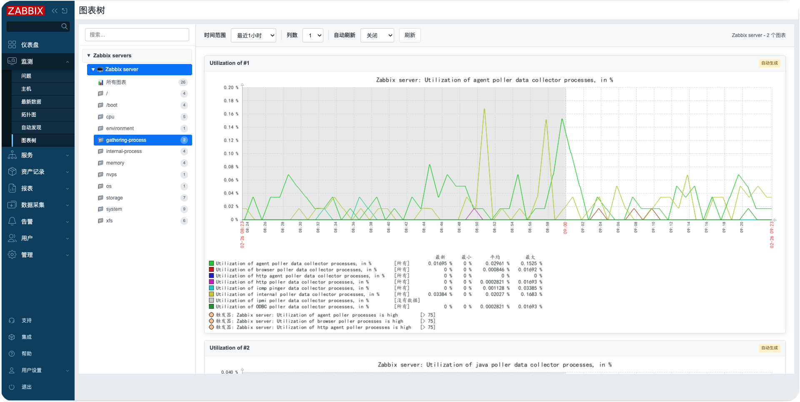

# Zabbix Graph Trees 模块

[English](README_en.md)

## ✨ 版本兼容性

本模块兼容 Zabbix 6.0 和 7.0+ 版本。

- ✅ Zabbix 6.0.x
- ✅ Zabbix 7.0.x
- ✅ Zabbix 7.4.x

**兼容性说明**：模块内置智能版本检测机制，自动适配不同版本的 Zabbix API 和类库，无需手动配置。

## 描述

这是一个 Zabbix 前端模块，提供树形资源浏览和监控图形可视化功能。模块在 Zabbix Web 的监控菜单下新增 Graph Trees 菜单，支持树形导航和实时图表展示。



## 功能特性

- **树形资源浏览**：
  - 主机分组层级展示
  - 主机列表展示
  - 快速搜索定位
  - 展开/收起控制
- **标记过滤**：
  - 支持按标记（Tag）和标记值筛选监控项
  - 监控项多选下拉框，灵活选择要展示的图表
- **图形展示**：
  - SVG折线图实时展示监控数据
  - 多图表tooltip同步显示
  - 图表放大全屏查看
  - 自动刷新功能（支持5/10/20/30/60秒间隔）
  - 多种时间范围选择（1小时至30天）
- **国际化支持**：支持中英文界面
- **响应式设计**：适配不同屏幕尺寸

## 安装步骤

### 安装模块

```bash
# Zabbix 6.0 / 7.0 部署方法
git clone https://github.com/X-Mars/zabbix_modules.git /usr/share/zabbix/modules/

# Zabbix 7.4 部署方法
git clone https://github.com/X-Mars/zabbix_modules.git /usr/share/zabbix/ui/modules/
```

### ⚠️ 修改 manifest.json 文件

```bash
# ⚠️ 如果使用Zabbix 6.0，修改manifest_version
sed -i 's/"manifest_version": 2.0/"manifest_version": 1.0/' zabbix_graphtrees/manifest.json
```

### 启用模块

1. 转到 **Administration → General → Modules**。
2. 点击 **Scan directory** 按钮扫描新模块。
3. 找到 "Zabbix Graph Trees" 模块，点击启用模块。
4. 刷新页面，模块将在 **Monitoring** 菜单下显示为 "Graph Trees" 子菜单。

## 注意事项

- **性能考虑**：对于大型环境，建议适当限制查询结果数量。
- **数据准确性**：显示的信息基于Zabbix数据库的当前状态。
- **监控项依赖**：图形展示依赖于相应的监控项配置。

## 开发

插件基于Zabbix模块框架开发。文件结构：

- `manifest.json`：模块配置
- `Module.php`：菜单注册
- `actions/GraphTrees.php`：图形树业务逻辑处理
- `actions/GraphTreesData.php`：数据获取业务逻辑处理
- `views/graphtrees.php`：图形树页面视图
- `lib/LanguageManager.php`：国际化语言管理
- `lib/ViewRenderer.php`：视图渲染工具
- `lib/ZabbixVersion.php`：版本兼容工具

如需扩展，可参考[Zabbix模块开发文档](https://www.zabbix.com/documentation/7.0/en/devel/modules)。

## 许可证

本项目遵循Zabbix的许可证。详情请见[Zabbix许可证](https://www.zabbix.com/license)。

## 贡献

欢迎提交问题和改进建议。

- **灵活的过滤**：
  - 按标记过滤监控项
  - 按标记值精确过滤
  - 多种预设时间范围
  - 自定义时间范围（开发中）

- **图形展示**：
  - 实时数据加载
  - 响应式布局
  - 支持多监控项
  - 自动刷新功能

- **国际化支持**：支持中英文界面
- **响应式设计**：适配不同屏幕尺寸
- **现代化界面**：采用清晰简洁的设计风格

## 安装步骤

### ⚠️ 重要提示：根据Zabbix版本修改manifest.json

**在安装前，请根据您的Zabbix版本修改 `manifest.json` 文件：**

- **Zabbix 6.0**: 将 `"manifest_version": 2.0` 改为 `"manifest_version": 1.0`
- **Zabbix 7.0+**: 保持 `"manifest_version": 2.0` 不变

```bash
# 对于Zabbix 6.0用户
sed -i 's/"manifest_version": 2.0/"manifest_version": 1.0/' zabbix_graphtrees/manifest.json

# 对于Zabbix 7.0+用户
# 无需修改，默认即可
```

### 方法1：直接复制到模块目录

1. 将 `zabbix_graphtrees` 文件夹复制到Zabbix模块目录：

```bash
cp -r zabbix_graphtrees /usr/share/zabbix/modules/
```

2. 在Zabbix Web界面中启用模块：
   - 转到 **Administration → General → Modules**
   - 点击 **Scan directory** 按钮扫描新模块
   - 找到 "Zabbix Graph Trees" 模块，点击启用
   - 刷新页面

### 方法2：从完整项目安装

如果你克隆了整个 zabbix_modules 项目：

```bash
cd /usr/share/zabbix/modules/
git clone https://github.com/X-Mars/zabbix_modules.git .
```

```bash
# ⚠️ 如果使用Zabbix 6.0，修改manifest_version
sed -i 's/"manifest_version": 2.0/"manifest_version": 1.0/' zabbix_graphtrees/manifest.json
```

然后按照上述步骤启用模块。

## 使用方法

### 访问模块

1. 登录Zabbix Web界面
2. 导航到 **Monitoring → Graph Trees**

### 浏览资源树

1. 左侧显示按主机分组组织的资源树
2. 点击分组名称可展开/收起主机列表
3. 使用顶部搜索框快速过滤主机
4. 使用"展开全部"/"收起全部"按钮控制树的显示

### 查看监控图形

1. 点击左侧树中的主机名称
2. 右侧将显示该主机的监控项
3. 使用顶部过滤器：
   - **标记**：选择特定的标记进行过滤
   - **标记值**：进一步按标记值过滤
   - **时间范围**：选择查看的时间范围
4. 点击"刷新"按钮更新图形数据

### 时间范围选项

- 最近1小时
- 最近3小时
- 最近6小时
- 最近12小时
- 最近24小时
- 最近7天
- 最近30天
- 自定义（开发中）

## 配置

### 权限要求

- 用户需要Zabbix用户或更高权限才能访问模块功能

### 标记配置

模块通过Zabbix的标记（Tags）系统来组织和过滤监控项。建议：

1. 为主机配置有意义的标记
2. 为监控项配置相应的标记
3. 使用一致的标记命名规范

### 性能考虑

- 默认限制每个主机显示100个监控项
- 历史数据查询限制为1000个数据点
- 对于大型环境，建议使用标记过滤减少数据量

## 注意事项

- **数据准确性**：图形基于历史数据，确保Zabbix历史数据保留足够长的时间
- **兼容性**：已在Zabbix 6.0和7.0环境中测试通过
- **浏览器要求**：建议使用现代浏览器（Chrome、Firefox、Edge等）
- **图表库**：当前版本使用简单的数据展示，可集成Chart.js等图表库实现更丰富的可视化

## 开发

模块基于Zabbix模块框架开发。文件结构：

- `manifest.json`：模块配置
- `Module.php`：菜单注册和版本适配
- `actions/`：业务逻辑处理
  - `GraphTrees.php`：主页面控制器
  - `GraphTreesData.php`：数据API控制器
- `views/`：页面视图
  - `graphtrees.php`：主页面视图
- `lib/`：工具类库
  - `ZabbixVersion.php`：版本检测
  - `ViewRenderer.php`：视图渲染
  - `LanguageManager.php`：国际化

## 许可证

MIT License

## 作者

火星小刘

## 贡献

欢迎提交问题和拉取请求！
