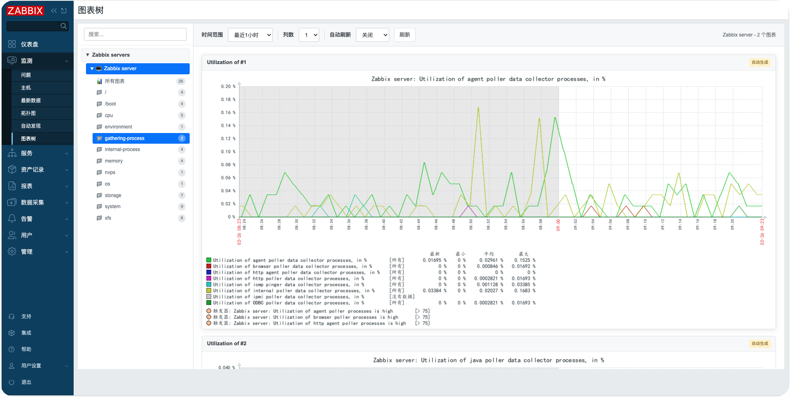
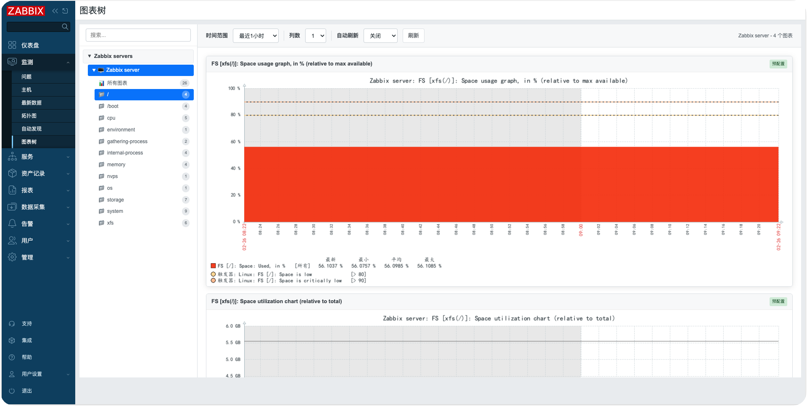

# Zabbix Graph Trees 模块

[English](README_en.md)

## ✨ 版本兼容性

本模块兼容 Zabbix 6.0 / 7.0+ / 8.0+ 版本。

- ✅ Zabbix 6.0.x
- ✅ Zabbix 7.0.x
- ✅ Zabbix 7.4.x
- ✅ Zabbix 8.0.x

**兼容性说明**：模块内置智能版本检测机制，自动适配不同版本的 Zabbix API 和类库，无需手动配置。

## 描述

这是一个 Zabbix 前端模块，提供树形资源浏览和监控图形可视化功能。模块在 Zabbix Web 的监控菜单下新增 Graph Trees 菜单，支持树形导航和实时图表展示。




## 功能特性

- **树形资源浏览**：
  - 主机分组层级展示
  - 主机列表展示
  - 快速搜索定位
  - 展开/收起控制
- **标记过滤**：
  - 支持按标记（Tag）和标记值筛选监控项
  - 监控项多选下拉框，灵活选择要展示的图表
- **图形展示**：
  - SVG折线图实时展示监控数据
  - 多图表tooltip同步显示
  - 图表放大全屏查看
  - 自动刷新功能（支持5/10/20/30/60秒间隔）
  - 多种时间范围选择（1小时至30天）
- **国际化支持**：支持中英文界面
- **响应式设计**：适配不同屏幕尺寸
- **现代化界面**：采用清晰简洁的设计风格

## 安装步骤

### 安装模块

```bash
# Zabbix 6.0 / 7.0 部署方法
git clone https://github.com/X-Mars/zabbix_modules.git /usr/share/zabbix/modules/

# Zabbix 7.4 / 8.0 部署方法
git clone https://github.com/X-Mars/zabbix_modules.git /usr/share/zabbix/ui/modules/
```

### ⚠️ 修改 manifest.json 文件

```bash
# ⚠️ 如果使用Zabbix 6.0，修改manifest_version
sed -i 's/"manifest_version": 2.0/"manifest_version": 1.0/' zabbix_graphtrees/manifest.json
```

### 启用模块

1. 转到 **Administration → General → Modules**。
2. 点击 **Scan directory** 按钮扫描新模块。
3. 找到 "Zabbix Graph Trees" 模块，点击启用模块。
4. 刷新页面，模块将在 **Monitoring** 菜单下显示为 "Graph Trees" 子菜单。

## 注意事项

- **性能考虑**：对于大型环境，建议适当限制查询结果数量。
- **数据准确性**：显示的信息基于Zabbix数据库的当前状态。
- **监控项依赖**：图形展示依赖于相应的监控项配置。

## 开发

插件基于Zabbix模块框架开发。文件结构：

- `manifest.json`：模块配置
- `Module.php`：菜单注册
- `actions/GraphTrees.php`：图形树业务逻辑处理
- `actions/GraphTreesData.php`：数据获取业务逻辑处理
- `views/graphtrees.php`：图形树页面视图
- `lib/LanguageManager.php`：国际化语言管理
- `lib/ViewRenderer.php`：视图渲染工具
- `lib/ZabbixVersion.php`：版本兼容工具

如需扩展，可参考[Zabbix模块开发文档](https://www.zabbix.com/documentation/7.0/en/devel/modules)。

## 许可证

本项目遵循Zabbix的许可证。详情请见[Zabbix许可证](https://www.zabbix.com/license)。
