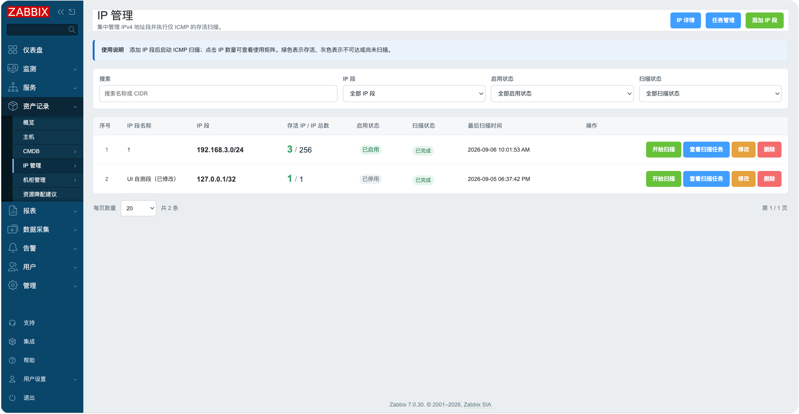
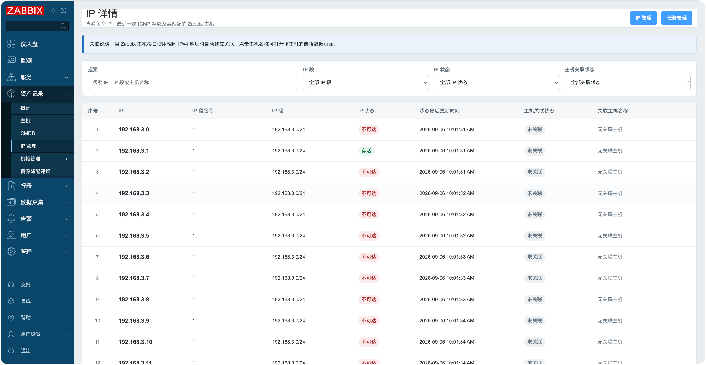
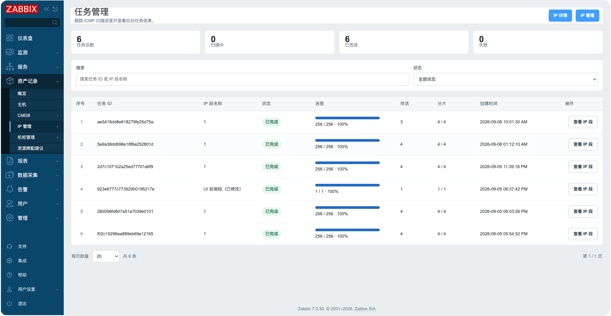

# Zabbix IPAM Module

[中文](README.md)

## ✨ Version Compatibility

This module is compatible with Zabbix 6.0, 7.0+, and 8.0+.

- ✅ Zabbix 6.0.x
- ✅ Zabbix 7.0.x
- ✅ Zabbix 7.4.x
- ✅ Zabbix 8.0.x

**Compatibility note**: The module includes Zabbix version detection and a custom `LanguageManager`. It automatically handles namespace and menu API differences and follows the user's Zabbix language setting, so no manual language selection is required.

## Description

This Zabbix frontend IP address management module centrally manages IPv4 ranges, performs asynchronous ICMP availability scans, and automatically associates addresses with Zabbix hosts by matching host interface IPs. It provides three pages under **Inventory → IPAM** in Zabbix Web: **IP Management**, **IP Details**, and **Task Management**.

Scanning uses ICMP only and does not connect to target TCP ports. Large ranges are automatically divided into shards and processed by background PHP CLI tasks, preventing long-running Zabbix Web requests.





## Features

- **IP range management**: Add, edit, and delete ranges in CIDR or IPv4 start-end format
- **Automatic filtering**: Press Enter in a search field to filter; select fields submit automatically
- **ICMP availability scanning**: Use `fping` to check whether addresses are reachable without probing TCP ports
- **Asynchronous tasks**: Create tasks from the Web UI and run them in the background with PHP CLI
- **Sharding and multiprocessing**: Use shards of 64 addresses by default and support parallel scans through `pcntl_fork`
- **Live progress**: Display scanned and reachable address counts, completed shard counts, and task status
- **Scheduled scanning**: Define the scan interval with crontab; each invocation scans every enabled IP range
- **IP usage matrix**: Display reachability using green and gray address cells
- **IP details list**: Show the IP address, range name, range, reachability status, and host association
- **Automatic host association**: Match Zabbix hosts by their interface IPv4 addresses
- **Latest data links**: Open a host's latest data page from its name in the list or from an associated reachable address in the matrix
- **Pagination**: Paginate every list and allow users to select the number of rows per page
- **Internationalization**: Follow the Zabbix user language automatically, with Simplified Chinese and English support
- **Responsive design**: Adapt to standard, wide, and narrow browser viewports without a fixed maximum width
- **Access and input controls**: Restrict access to Zabbix administrators and validate IPv4 and numeric input

## How It Works

```text
IP Management page / crontab
        ↓
Create an IP range scan task
        ↓
Background PHP CLI process
        ↓
Split into 64-address shards → fping ICMP probes
        ↓
JSON results and task progress → IP matrix / IP Details / Task Management
```

- When a user clicks **Start scan** in the Web UI, the module starts a separate PHP CLI process through PHP `exec()` and `nohup`.
- Scheduled scans run directly through `cli/scan_cron.php`. Each cron invocation creates tasks for all enabled ranges that do not already have a pending or running task.
- When `pcntl_fork()` is available in the CLI environment, the scanner runs up to four worker processes in parallel. Otherwise, it automatically runs serially.
- Scan status and results are stored in JSON files. Writes use file locks and atomic replacement through temporary files so that Web and cron processes can access the data concurrently.

## Installation

### Install the Module

```bash
# Common module path for Zabbix 6.0 / 7.0
cp -a zabbix_ipam /usr/share/zabbix/modules/

# Common module path for Zabbix 7.2+ / 7.4 / 8.0
cp -a zabbix_ipam /usr/share/zabbix/ui/modules/
```

Use the `$ZBX_MODULES_DIR` value configured for your Zabbix frontend if its module directory differs from these examples.

### ⚠️ Change manifest.json When Required

```bash
# ⚠️ Run only if Zabbix 6.0 cannot recognize manifest_version 2.0
sed -i 's/"manifest_version": 2.0/"manifest_version": 1.0/' zabbix_ipam/manifest.json
```

### Configure Directory Permissions

Both the Web service user and the cron user must be able to read and write `data/`, `data/scan_tasks/`, and `data/results/`. Using the same account is recommended. If different accounts are used, grant access through a shared group. Replace the paths below with the module's actual installation path.

```bash
# Debian / Ubuntu example
chown -R www-data:www-data zabbix_ipam/data
chmod -R 770 zabbix_ipam/data

# RHEL / Rocky Linux example
chown -R apache:apache zabbix_ipam/data
chmod -R 770 zabbix_ipam/data
```

### Install Scan Dependencies

```bash
# Debian / Ubuntu
apt install fping php-cli php-pcntl

# RHEL / Rocky Linux
dnf install fping php-cli php-process
```

`php-pcntl` or `php-process` enables multiprocessing. Without `pcntl`, the module automatically falls back to serial background scanning. PHP CLI and `fping` are required for scanning.

After installation, verify the runtime as the Web service user:

```bash
# Debian / Ubuntu
sudo -u www-data /usr/bin/php -r 'echo PHP_SAPI, PHP_EOL;'
sudo -u www-data /usr/bin/fping -c 1 -t 350 127.0.0.1

# RHEL / Rocky Linux
sudo -u apache /usr/bin/php -r 'echo PHP_SAPI, PHP_EOL;'
sudo -u apache /usr/sbin/fping -c 1 -t 350 127.0.0.1
```

To start scans manually from the Web UI, make sure PHP has not disabled `exec` and that the Web service user is allowed to run PHP CLI. If your security policy prohibits `exec`, you can still use only the scheduled cron entry point described below.

### Enable the Module

1. Go to **Administration → General → Modules**.
2. Click **Scan directory** to discover newly installed modules.
3. Find the **IPAM** module and enable it.
4. Refresh the page. The **Inventory → IPAM** menu will contain **IP Management**, **IP Details**, and **Task Management**.

## Scheduled Scanning

`cli/scan_cron.php` is the only scheduled scan entry point. The crontab frequency defines the scan interval. The following examples scan all enabled IP ranges every five minutes. A duplicate task is not created when the same range already has a pending or running task. Do not run scans as `root`.

When creating `/etc/cron.d/zabbix-ipam`, include the account that runs the command:

```cron
*/5 * * * * apache /usr/bin/php /usr/share/zabbix/modules/zabbix_ipam/cli/scan_cron.php >> /var/log/zabbix/ipam-cron.log 2>&1
```

On Debian and Ubuntu, replace `apache` with `www-data` in most installations. When using `crontab -u apache -e` or `crontab -u www-data -e`, do not include the username again in the cron expression:

```cron
*/5 * * * * /usr/bin/php /usr/share/zabbix/modules/zabbix_ipam/cli/scan_cron.php >> /var/log/zabbix/ipam-cron.log 2>&1
```

For Zabbix 7.2+, 7.4, and 8.0, the script path is commonly `/usr/share/zabbix/ui/modules/zabbix_ipam/cli/scan_cron.php`. Make sure the selected account can also write to the log directory. Task state files and worker locks prevent the same IP range from being submitted more than once at a time.

### Test the Cron Entry Point Manually

```bash
# Select apache or www-data for your environment and replace the module path
sudo -u apache /usr/bin/php /usr/share/zabbix/modules/zabbix_ipam/cli/scan_cron.php
```

No command output and a new entry on the Task Management page usually indicate a successful run. Errors are written to standard error.

## Pages

- **IP Management**: Add and maintain IP ranges, start scans, view scan tasks, and open the IP usage matrix
- **IP Details**: Filter all addresses by keyword, IP range, IP status, and host association status
- **Task Management**: Filter background scan tasks by IP range name, task status, or keyword, and view pending, running, completed, failed, or stopped tasks

Click **Alive IPs / Total** to open the IP usage matrix. Green indicates that an address was reachable during the latest ICMP scan; gray indicates that it was unreachable or has not yet been scanned. If a green address is associated with a Zabbix host, click it to open that host's latest data page.

## Important Notes

- **Authorization**: Scan only networks you are authorized to scan.
- **Address limits**: Only IPv4 is supported, with a maximum of 65,536 addresses per range.
- **Filesystem permissions**: The Zabbix Web and cron users must be able to write to the module's `data/` directory.
- **ICMP permissions**: Make sure the server firewall permits ICMP and that `fping` can run successfully.
- **Command execution**: Manual Web scans depend on PHP `exec()`; cron scans do not rely on a Web request to start a background process.
- **Performance**: Large ranges are processed in shards, with a default maximum of four parallel worker processes.
- **Host matching**: Associations are derived from the Zabbix host interfaces accessible to the current user.
- **Data storage**: Data is currently stored in JSON files. Back up the `data/` directory regularly in production.

## Troubleshooting

- **A scan fails immediately after clicking Start scan**: Confirm that PHP CLI exists, PHP `exec()` is enabled, and `data/scan_tasks/` is writable.
- **Every address is reported as unreachable**: Run `fping` directly as the Web or cron user and verify its installation path, execute permissions, firewall rules, and ICMP policy. The module checks `/usr/sbin/fping`, `/usr/bin/fping`, and `/sbin/fping`, in that order.
- **A task remains pending**: Check `data/scan_tasks/<task ID>.log`, the PHP CLI path, and any SELinux or AppArmor restrictions.
- **Cron does not create a task**: Confirm that the IP range is enabled and that the same range does not already have a `pending` or `running` task.
- **An IP range cannot be saved**: Check ownership and permissions for `data/`. The module must be able to create lock files and temporary JSON files.
- **An address is not associated with a host**: Confirm that a Zabbix host interface uses the exact same IPv4 address and that the current user has permission to view that host.

## Development

The module is built on the Zabbix module framework. Its main files are:

- `manifest.json`: Module metadata and page routes
- `Module.php`: Inventory menu registration
- `actions/IpManager.php`: IP range list business logic
- `actions/IpDetail.php`: IP details, host association filters, and pagination
- `actions/IpScan.php`: Scan task list business logic
- `actions/IpAjax.php`: AJAX endpoints for saving, deleting, scanning, and the IP matrix
- `views/ip.manager.php`: IP Management page
- `views/ip.detail.php`: IP Details page
- `views/ip.scan.php`: Task Management page
- `lib/HostMatcher.php`: Zabbix host interface IP matching
- `lib/IpScanner.php`: ICMP scanning, sharding, and multiprocessing core
- `lib/IpStorage.php`: JSON data storage
- `lib/TaskManager.php`: Background tasks and scheduled scan management
- `lib/LanguageManager.php`: Chinese and English language management
- `lib/ViewRenderer.php`: View rendering
- `lib/ZabbixVersion.php`: Zabbix version compatibility detection
- `assets/`: Page styles and client-side scripts
- `cli/scan_cron.php`: Cron scan entry point

For extension and module development details, see the [Zabbix module development documentation](https://www.zabbix.com/documentation/7.0/en/devel/modules).

## License

This project follows the Zabbix licensing terms. See the [Zabbix license](https://www.zabbix.com/license) for details.
