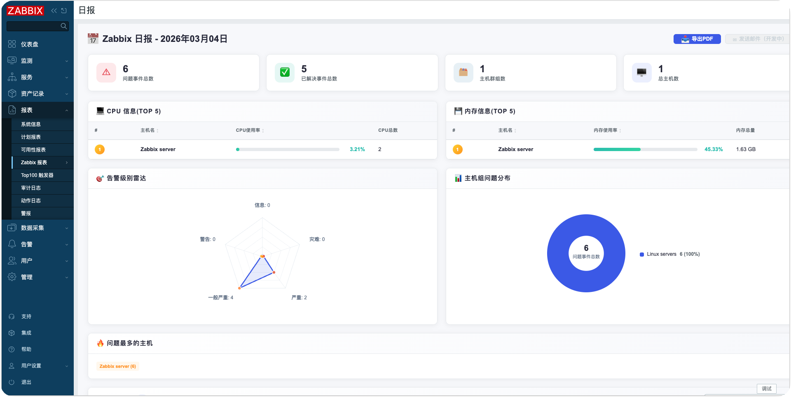
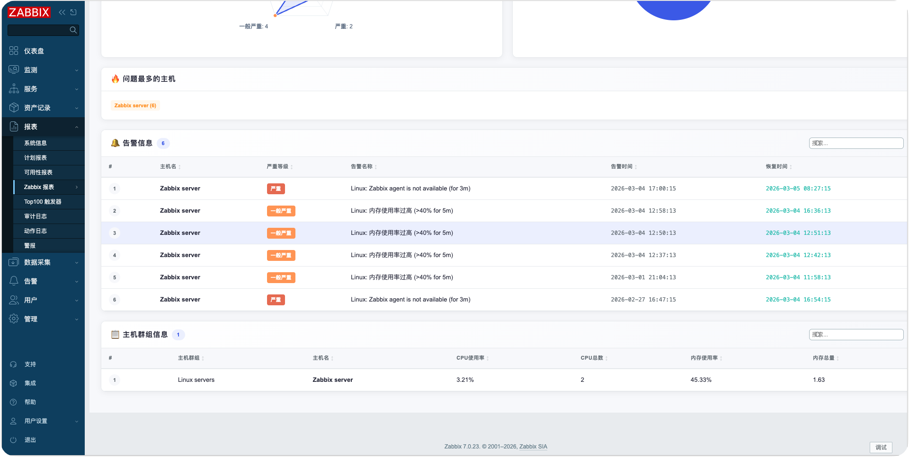

# Zabbix Reports 模块

[English](README_en.md)

## ✨ 版本兼容性

本模块兼容 Zabbix 6.0 / 7.0+ / 8.0+ 版本。

- ✅ Zabbix 6.0.x
- ✅ Zabbix 7.0.x
- ✅ Zabbix 7.4.x
- ✅ Zabbix 8.0.x

**兼容性说明**：模块内置智能版本检测机制，自动适配不同版本的 Zabbix API 和类库，无需手动配置。

## 描述

这是一个 Zabbix 前端模块，用于生成每日、周、月报表。模块在 Zabbix Web 的报表菜单下新增 Zabbix Reports 菜单，支持报表预览、PDF导出和邮件推送功能。




## 功能特性

- **报表类型**：支持每日、周、月报表，以及自定义时间范围报表
- **报表内容**：
  - 报警数量和状态统计
  - 报警最多的主机（前10名）
  - CPU使用率最高的主机（前10名）
  - 内存使用率最高的主机（前10名）
- **功能**：
  - 页面预览报表
  - 手动导出PDF
  - 邮件推送报表（HTML格式）
  - 自定义日期范围选择
- **国际化支持**：支持中英文界面
- **响应式设计**：适配不同屏幕尺寸
- **现代化界面**：采用渐变色彩和动画效果的现代化设计
- **兼容性**：支持Linux Agent和Windows Agent模板
- **统计信息**：显示报警总数、活跃问题数等统计数据

## 安装步骤

### 安装模块

```bash
# Zabbix 6.0 / 7.0 部署方法
git clone https://github.com/X-Mars/zabbix_modules.git /usr/share/zabbix/modules/

# Zabbix 7.4 / 8.0 部署方法
git clone https://github.com/X-Mars/zabbix_modules.git /usr/share/zabbix/ui/modules/
```

### ⚠️ 修改 manifest.json 文件

```bash
# ⚠️ 如果使用Zabbix 6.0，修改manifest_version
sed -i 's/"manifest_version": 2.0/"manifest_version": 1.0/' zabbix_reports/manifest.json
```

### 启用模块

1. 转到 **Administration → General → Modules**。
2. 点击 **Scan directory** 按钮扫描新模块。
3. 找到 "Zabbix Reports" 模块，点击启用模块。
4. 刷新页面，模块将在 **Reports** 菜单下显示为 "Zabbix Reports" 子菜单。

## 注意事项

- **性能考虑**：对于大型环境，建议适当限制查询结果数量。
- **数据准确性**：显示的信息基于Zabbix数据库的当前状态。
- **邮件配置**：邮件推送功能依赖于Zabbix的邮件配置。

## 开发

插件基于Zabbix模块框架开发。文件结构：

- `manifest.json`：模块配置
- `Module.php`：菜单注册
- `actions/CustomReport.php`：自定义报表业务逻辑处理
- `actions/DailyReport.php`：日报表业务逻辑处理
- `views/reports.custom.php`：自定义报表页面视图
- `views/reports.daily.php`：日报表页面视图
- `lib/LanguageManager.php`：国际化语言管理
- `lib/ViewRenderer.php`：视图渲染工具
- `lib/ZabbixVersion.php`：版本兼容工具

如需扩展，可参考[Zabbix模块开发文档](https://www.zabbix.com/documentation/7.0/en/devel/modules)。

## 许可证

本项目遵循Zabbix的许可证。详情请见[Zabbix许可证](https://www.zabbix.com/license)。
