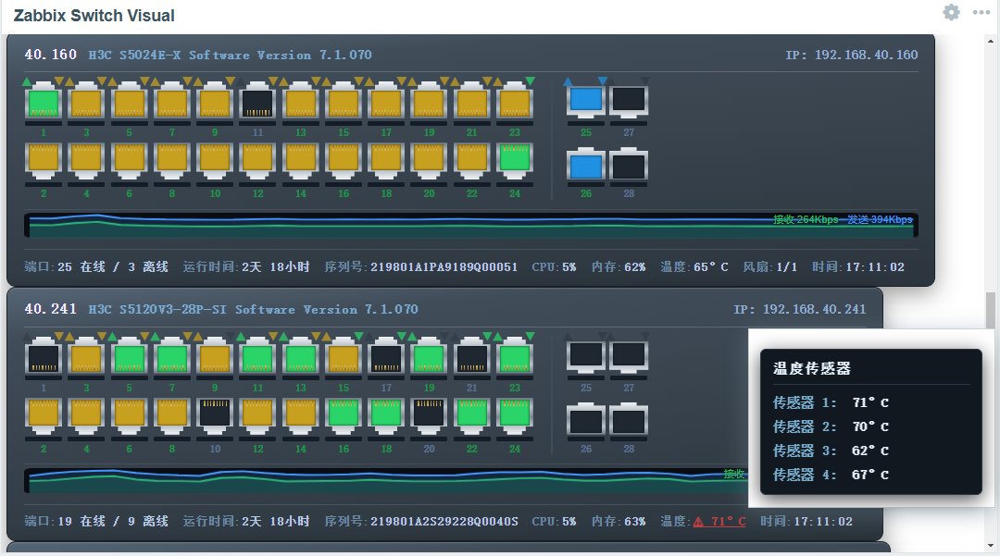

# Zabbix Switch Visual

[中文](README.md)

## Version compatibility

The current code uses the Zabbix custom dashboard widget framework with `manifest_version: 2.0` and primarily targets **Zabbix 7.x**. It includes a guard for the color-picker change in 7.4, but there is no version-by-version installation or interaction test record yet.

| Zabbix version | Current status |
| --- | --- |
| 6.0 / 6.2 | Not supported yet. These releases register dashboard widgets differently; changing only `manifest_version` to `1.0` cannot install this widget. |
| 6.4 | Adaptation and validation are incomplete. The current collapsible form groups and JavaScript lifecycle methods may need changes. |
| 7.0–7.4 | Target range of the current implementation. Verify the form, port links, and data on your exact frontend version before deployment. |
| 8.0 | Not validated. Frontend APIs may change while 8.0 is in development. |

Full 6.0–8.0 coverage requires a separate legacy widget entry point for 6.0/6.2 and practical validation of 6.4 and 8.0. The `manifest_version` adjustment described in [Zabbix CMDB](../zabbix_cmdb/README_en.md) is insufficient for this widget.

## Description

Zabbix Switch Visual is a dashboard widget for monitoring switch ports. It builds a visual switch chassis with RJ45/SFP ports, status, traffic, and summary information from Zabbix items. The interface supports English and Simplified Chinese.

## Features

- **Host selection:** Display one host or multiple switches from selected host groups.
- **Port visualization:** Show RJ45/SFP ports, link state, speed, inbound/outbound traffic, errors, and alerts; click a port to open related monitoring data.
- **Port layout:** Configure a fixed or automatically detected port count, stack members, row order, SNMP index offset, exclusions, and manual aliases.
- **Trends and summary:** Show per-port and aggregate traffic sparklines, plus uptime, model, serial number, CPU, memory, temperature, PoE, and fan information. Optional metrics appear only when their items are configured.
- **Appearance:** Adjust port style, colors, zoom, and summary display.
- **Localization:** Use English or Simplified Chinese according to the Zabbix user's language.

## Installation

1. Copy the **entire** `zabbix_switch_visual` directory from this repository into the Zabbix frontend `modules` directory. Its location depends on the frontend package; `/usr/share/zabbix/ui/modules/` is one example.
2. In the frontend, open **Administration → General → Modules**, click **Scan directory**, and enable **Zabbix Switch Visual**.
3. Edit a dashboard, add the **Zabbix Switch Visual** widget, choose a host or host groups, and save.

Keep the directory name `zabbix_switch_visual` and its `manifest.json`, `Widget.php`, `actions/`, `includes/`, `views/`, and `assets/` contents together. Do not change the current manifest to version `1.0` for installation on 6.0/6.2.

## Item configuration

The widget matches port data by item-key patterns. The defaults are listed below; `*` stands for the port index and should be adjusted to your template.

| Data | Default key pattern |
| --- | --- |
| Inbound traffic | `ifInOctets[*]` |
| Outbound traffic | `ifOutOctets[*]` |
| Port status | `ifOperStatus[*]` |
| Port speed | `ifHighSpeed[*]` |
| Inbound errors | `ifInErrors[*]` |
| Outbound errors | `ifOutErrors[*]` |

“Bandwidth items deliver bits/sec” is enabled by default. Disable it if your items return bytes per second. Raw cumulative counters need rate preprocessing in Zabbix first. PoE, duplex, SFP optical power, and system item keys are optional; leaving them empty omits those metrics.

Automatic detection may include VLAN, tunnel, or management interfaces; use the excluded-port rules to filter them. Large host groups trigger more Zabbix API queries, so first validate the item patterns and layout on one switch.

## Project structure

- `manifest.json`: Widget identity, actions, and frontend assets.
- `Widget.php`, `includes/WidgetForm.php`: Widget name and configuration fields.
- `actions/WidgetView.php`, `includes/DataFetcher.php`: Host and item data retrieval.
- `views/widget.edit.php`, `views/widget.view.php`: Configuration form and port visualization.
- `assets/js/class.widget.js`, `assets/css/switch_monitor.css`: Frontend interaction and styling.
- `includes/Translation.php`: English and Chinese UI text.

See the [official Zabbix widget development documentation](https://www.zabbix.com/documentation/7.0/en/devel/modules/widgets) for the widget APIs.
